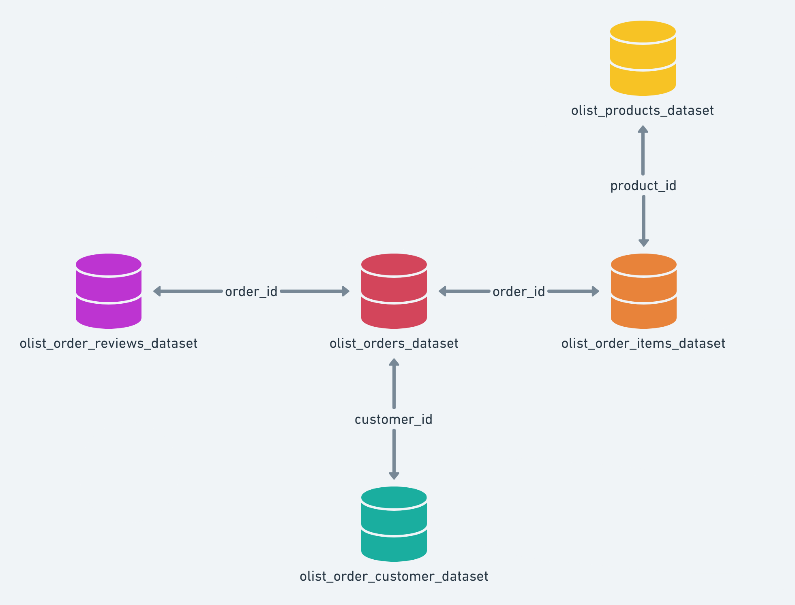

Análise de Dados de E-commerce com SQL

PRINCIPAIS INSIGHTS

1. Maior tempo de entrega implicam em avaliações significativamente mais baixas
2. Entregas realizadas em até 10 dias concentram a maior parte das melhores avaliações
3. Estados da região Norte apresentam maior atraso para a entrega
4. Ticket médio é relativamente baixo (R$ 137,75), indicando potencial para aumento de receita por pedido
5. Produtos de beleza e saúde apresentam a maior receita

VISÃO GERAL

Este projeto tem como objetivo construir uma base analítica em SQL, praticando queries em um dataset de e-commerce, disponível em https://www.kaggle.com/datasets/olistbr/brazilian-ecommerce.

O foco do projeto é simular a construção de uma base analítica em um cenário real, lidando com problemas como integração de várias tabelas, controle de granularidade e consistência dos dados, além de responder algumas perguntas de negócio com a base finalizada.

OBJETIVOS

1. Praticar JOINs e agregações em SQL
2. Entender os problemas que podem aparecer com a granularidade dos dados
3. Construir uma base pronta para análise
4. Identificar e corrigir problemas comuns em modelagem de dados
5. Responder perguntas de negócio a partir dos dados estruturados

PERGUNTAS DE NEGÓCIO

A base foi estruturada para responder questões como:

1. Qual o ticket médio por pedido?
2. Qual o ticket médio por estado (UF)?
3. Quais estados apresentam maior atraso logístico?
4. Quais categorias de produtos geram maior receita?
5. Existe relação entre peso do produto e tempo de entrega?
6. O atraso impacta a avaliação do cliente?

ESTRUTURA DOS DADOS

O projeto integra as seguintes tabelas disponibilizadas na plataforma Kaggle:

1. orders (informações dos pedidos)
2. customers (informações dos clientes)
3. order_items (itens de pedido: preço e frete por produto)
4. products (informações descritivas dos produtos)
5. order_payments (informações dos pagamentos)
6. order_reviews (informações das avaliações dos clientes)

IMAGEM DO MODELO



GRANULARIDADE DOS DADOS

Para garantir consistência nas análises, foi necessário diferenciar os níveis de granularidade das tabelas:

1. Pedido (order): representa uma compra realizada por um cliente (order_id)
2. Item do pedido (order_item): representa um produto dentro de um pedido
3. Produto (product): representa o item vendido, independentemente do pedido

Um pedido pode conter múltiplos itens, e cada item está associado a um único produto.

Por isso, foram criadas duas views com granularidades diferentes:

1. pedidos_base (1 linha = 1 pedido)
2. itens_base (1 linha = 1 produto dentro de um pedido)

CONSTRUÇÃO DAS VIEWS

1. pedidos_base

Foi criada para que cada linha corresponda a um pedido.
 
Ela contém as seguintes informações:

order_id                       -- id de cada pedido
customer_id                    -- id de cada cliente
customer_state                 -- estado (UF) do cliente
order_purchase_timestamp       -- data da compra
order_delivered_customer_date  -- data da entrega ao cliente
order_estimated_delivery_date  -- previsão de entrega
tempo_entrega                  -- diferença entre data da entrega ao cliente e data da compra
atraso                         -- diferença entre data da entrega ao cliente e previsão de entrega
review_score                   -- avaliação do pedido
total_pedido                   -- somatório do preço dos produtos em cada pedido
frete_total                    -- somatório do preço do frete dos produtos em cada pedido

Os valores de total_pedido e frete_total são obtidos a partir da agregação (SUM) da tabela order_items, garantindo que cada pedido seja representado por uma única linha.

2. itens_base

Foi criada para que cada linha corresponda a um item. 

Ela contém as seguintes informações:

order_id                       -- id de cada pedido
product_id                     -- id do produto
product_category_name          -- categoria do produto
product_weight_g               -- peso do produto (em gramas)
order_purchase_timestamp       -- data da compra
order_delivered_customer_date  -- data da entrega ao cliente
order_estimated_delivery_date  -- previsão de entrega
tempo_entrega                  -- diferença entre data da entrega ao cliente e data da compra
atraso                         -- diferença entre data da entrega ao cliente e previsão de entrega
price                          -- preço de cada produto
freight_value                  -- preço do frete do produto

Essa view mantém o nível mais granular dos dados, permitindo análises relacionadas a produtos e suas características.

ANÁLISES DE NEGÓCIO

## 1. Ticket médio por pedido

### Consulta SQL

``` sql

SELECT AVG(total_pedido) AS ticket_medio
FROM pedidos_base;
```

Resultado:

Ticket médio: R$ 137,75

Interpretação:

Indica que os pedidos tendem a ter baixo valor médio. Os clientes tendem a realizar compras pequenas, em cada transação.

Estratégias Recomendadas:

Incentivo de gastos em maior quantidade, utilizando recomendações avaliadas em padrões de compras de cada cliente, podem ser utilizadas.

## 2. Ticket médio dos pedidos por estado

### Consulta SQL

``` sql

SELECT 
	customer_state, 
	COUNT(*) AS total_pedidos, 
	AVG(total_pedido) AS ticket_medio
FROM pedidos_base
GROUP BY customer_state
ORDER BY total_pedidos DESC;
```
Resultado:

Paraíba com um ticket médio de R$ 216,66, liderando o ranking dos estados brasileiros. São Paulo com um ticket médio de R$ 125,75 apresenta o menor valor

Interpretação:

São Paulo apresenta o menor ticket médio entre os estados analisados, porém concentra a maior quantidade de pedidos, indicando um alto volume de transações com menor valor médio por compra.

Estratégias Recomendadas:

Incentivo ao aumento no valor das compras dos clientes de São Paulo e estratégias para alavancar as vendas na Paraíba.

## 3. Média de dias de atraso por estado

### Consulta SQL

``` sql

SELECT 
	customer_state, 
	COUNT(customer_state) AS total_compras, 
	AVG(atraso) AS media_dias_atraso
FROM pedidos_base
GROUP BY customer_state
ORDER BY media_dias_atraso DESC;
```
Resultado:

Alagoas, com o melhor resultado entre os estados, apresentou uma média de atraso de 7 dias. Os 5 piores estados estão na região norte, com uma média superior a 15 dias de atraso.

Interpretação:

Estados da região norte apresentam maiores médias de atraso.

Estratégias Recomendadas:

Verificar os desafios logísticos relacionados à distância ou infraestrutura.

## 4. Receita por categoria de produto

### Consulta SQL

``` sql

SELECT 
    product_category_name,
    SUM(price) AS receita,
	COUNT(*) AS total_vendas
FROM itens_base
GROUP BY product_category_name
ORDER BY receita DESC;

```
Resultado:

9670 produtos de beleza e saúde, totalizando uma receita de R$ 1.258.681,34, lideram o ranking. Vem seguido de 5991 vendas de relógios, com uma receita de R$ 1.205.005,68.

Interpretação:

Produtos de cama/mesa/banho e beleza/saúde lideram no número de vendas, mostrando ser um ponto forte para as vendas da empresa.

Estratégias Recomendadas:

Adotar práticas de promoções e propagandas desses produtos que lideram, focando no que a empresa tem acertado.

## 5. Peso do produto pelo tempo de entrega

### Consulta SQL

``` sql

SELECT
	product_category_name,
	AVG(product_weight_g) AS peso_medio,
	AVG(tempo_entrega) AS tempo_medio
FROM itens_base
GROUP BY product_category_name
ORDER BY peso_medio ASC;

```
Resultado:

Móveis de escritório (média de 20 dias de atraso), móveis para quarto (média de 12 dias de atraso) e eletrodomésticos (média de 13 dias de atraso) são os itens mais pesados vendidos pela loja

Interpretação:

Móveis de escritório apresentam o maior peso e também a maior média de atrasos, apontando para um possível problema com o fornecedor ou a logística desses materiais.

Estratégias Recomendadas:

Verificar os desafios logísticos relacionados à carga.

## 6. Tempo de entrega x Avaliação do cliente

### Consulta SQL

``` sql

SELECT
    review_score,
    COUNT(*) AS total_pedidos,
    AVG(tempo_entrega) AS tempo_medio
FROM pedidos_base
GROUP BY review_score
ORDER BY review_score;

```
Resultado:

56955 vendas receberam avaliação máxima dos clientes e elas apresentaram, em média, um prazo de 10 dias até a entrega. 11316 vendas receberam a pior avaliação e elas apresentaram, em média, um prazo de 20 dias até a entrega.

Interpretação:

Existe uma forte associação entre o tempo de entrega e a avaliação do cliente

Estratégias Recomendadas:

Identificação de gargalos logísticos e um monitoramento de tempo médio de entrega por região

CONCLUSÃO

A construção dessa base evidenciou a importância de uma criteriosa modelagem dos dados. A definição de cada chave primária e a forma de realização dos JOINS tem um impacto relevante no trabalho. Decisões incorretas nesse princípio geram duplicidades de registros e comprometem a qualidade das análises.

Durante o processo, foi identificada uma inconsistência na tabela de avaliações, na qual a coluna `review_id`, inicialmente considerada como chave primária, apresentava valores duplicados. Para garantir a integridade dos dados, foi necessária a criação de uma chave substituta (`review_row_id`) para garantir que cada registro era único.

A padronização dos campos de data no dataset facilitou significativamente as análises temporais, permitindo a construção de métricas para avaliar tempo de entrega e atrasos nas entregas.

Devido às diferençãs de granularidade das tabelas, foram criadas duas views para as análises, uma para analisar no nível dos pedidos (`pedidos_base`) e outra para analisar no nível dos itens (`itens_base`).

Algumas limitações do trabalho precisam ser consideradas, como a presença de informações nulas que não foram tratadas e também algumas considerações de correlação que não foram avaliadas estatísticamente.

Ainda assim, as análises realizadas demonstraram que o SQL é uma ferramenta eficaz para exploração de dados e geração de insights de negócio, permitindo identificar padrões relevantes
